# AI Business Process Failure Investigator

RevOps / Business Operations Analyst tool for investigating **silent business process failures** in exported JSON logs from multi-system workflows (e-commerce checkout, fintech settlement, B2B SaaS provisioning).

## The Problem

When a customer reports a stuck order or missing provisioning, analysts export logs from 4–6 services. Failures are often silent — HTTP 200 everywhere, no ERROR — but the business process never completed. A single LLM prompt conflates symptoms with root cause and cites the wrong evidence.

## Architecture

```mermaid
flowchart LR
  subgraph input [Incident Input]
    Logs[Raw JSON Logs]
    Context[Process Context]
  end

  subgraph investigation [Stage 3 Investigation]
    Pre[Deterministic Timeline]
    Base[Baseline LLM]
    RC[Rule Checker LLM]
    Adj[Adjudication LLM]
    Gates[Deterministic Safety Gates]
    Pre --> Base --> RC --> Adj --> Gates
  end

  subgraph postmortem [Post-Mortem]
    Hydrate[LogLookupTool Pre-Hydrate]
    PM[Post-Mortem Reporter LLM]
    Table[Deterministic Evidence Table]
    Trace[Deterministic Evidence Trace]
    Hydrate --> PM --> Table --> Trace
  end

  subgraph ui [Product UI]
    API[FastAPI]
    SPA[Investigation Interface]
    API --> SPA
  end

  Logs --> Pre
  Context --> Pre
  Gates --> Hydrate
  Trace --> API
```



**Authority model:** `InvestigationResult` from Stage 3 is immutable. The post-mortem reporter and UI may explain but cannot change `divergence_step`, `root_cause_category`, or `culprit_log_ids`.

**Evidence hydration:** `LogLookupTool.fetch_log_details` runs deterministically in Python before the post-mortem LLM call — logs are injected into the prompt; the LLM does not invoke tools at runtime.

## Fair Comparison Contract

| Control | Rule |
|---------|------|
| Model | Same `GEMINI_MODEL` for all stages |
| Token budget | Same `MAX_OUTPUT_TOKENS` |
| Business inputs | `process_context` + `raw_logs` only |
| Preprocessing | Not hidden in baseline; measured at Stage 1 |
| Prompts | Frozen in `shared/prompts.py` — not tuned against eval |

## Ablation Ladder

| Stage | Description |
|-------|-------------|
| 0 | Baseline — raw single prompt |
| 1 | Baseline — single prompt + deterministic timeline |
| 2 | Preprocess + Rule Checker (no verifier) |
| 3 | Full workflow (baseline + challenger + adjudication verifier + deterministic gates) |

## Evaluation Rubric (IQS)

| Dimension | Weight |
|-----------|--------|
| Failure point | 35% |
| Root cause category | 30% (exact = 1.0, documented equivalent = 0.5) |
| Evidence recall | 15% |
| Evidence precision | 10% |
| No fabricated evidence | 10% |

Root-cause categories use **tolerant scoring** (Track B): exact enum match = 1.0; semantically overlapping categories documented in `shared/root_cause_taxonomy.py` = 0.5 partial credit. Wrong `divergence_step` is never partial. Re-score saved runs without LLM calls: `python rescore_eval.py`.

## Canonical Evaluation (Development Benchmark)

**Methodology note:** The reported **89.73%** Stage 3 mean IQS is measured on the **fixed 15-case development benchmark**. It is **not** a universal accuracy claim.

| Metric | Value |
|--------|-------|
| Development benchmark size | **15 cases** (`case_01`–`case_15`) |
| Stage 0 canonical IQS | **89.06%** |
| Stage 3 canonical IQS | **89.73%** |
| Improvement (Stage 3 vs Stage 0) | **+0.67 percentage points** |
| Canonical artifact | `results/eval_submission.json` |

**How the canonical file was built:**
- **`results/eval_submission.json`** is the **single public canonical artifact** for development-benchmark metrics. It embeds the **frozen Stage 0 checkpoint** and the **fresh Stage 3 comparison** in one file — judges do not need any other eval JSON to verify the reported numbers.
- Stage 0 rows inside `eval_submission.json` were imported from an internal frozen run (recorded in the file’s `config.stage_0_source` metadata). That source file is **not** required for submission review.
- **Stage 3** is the **fresh canonical Stage 3 run** recorded in that same file.
- `python run_eval.py` writes **`results/eval_latest.json`** during ablation runs. It does **not** recreate `eval_submission.json` automatically.
- A fresh LLM re-run may differ slightly from **89.73%** due to model variance. Use the committed `eval_submission.json` for submission metrics.

### Holdout (Generalization — Separate Dataset)

| Metric | Value |
|--------|-------|
| Holdout size | **8 cases** (`case_16`–`case_23`, `data/holdout/`) |
| Stage 0 IQS | **78.56%** |
| Stage 3 IQS | **74.81%** |
| Change | **−3.75 pp** (known regression) |
| Canonical artifact | `results/eval_holdout.json` |

Holdout cases were **never used for prompt or gate tuning**. The regression demonstrates a known **distribution-shift limitation** (evidence-to-step attribution under unseen scenarios), not hidden tuning on the dev set.

Forensic write-ups: `results/holdout_forensic_analysis.md`, `results/step_attribution_analysis.md`

## LLM Provider

The live demo and evaluation runners call an LLM via OpenRouter (recommended) or direct Google Gemini.

### Required for the web demo

1. Copy the example env file: `cp .env.example .env`
2. Set **`OPENROUTER_API_KEY`** in `.env` with **your own** API key
3. **Do not commit `.env`** — it is gitignored and must stay local
4. Start the UI: `python run_ui.py` — each investigation requires a valid key (~20–30s per case)

Example `.env` (OpenRouter):

```env
LLM_PROVIDER=openrouter
OPENROUTER_API_KEY=your_key
OPENROUTER_MODEL=google/gemini-2.5-flash
MAX_OUTPUT_TOKENS=2048
```

Optional direct Google Gemini:

```env
LLM_PROVIDER=gemini
GEMINI_API_KEY=your_key
GEMINI_MODEL=gemini-flash-latest
```

## Demo — Web UI

```bash
python run_ui.py
# Landing page:  http://127.0.0.1:8080
# Investigator:  http://127.0.0.1:8080/investigate
```

The investigator exposes **all 15 benchmark cases** in a selectable grid. **Case 01 is auto-selected** on load; you can click any case to switch.

1. Open `/investigate` (or click **Try Now** from the landing page).
2. Pick any benchmark case from the grid — **Cases 01, 11, 14, and 15** are good recommended examples ( varied failure patterns), but any of the 15 works.
3. Review incident metadata (process, sequence, log count).
4. Click **Investigate Incident** — runs the real Stage 3 workflow + post-mortem reporter (~20–30s per case, requires API key).
5. Walk through: Investigation Trace → Authoritative Diagnosis → Evidence → Causal Chain → Post-Mortem.
6. Open the **Evaluation** tab to inspect canonical benchmark metrics from `eval_submission.json`.
7. Use **Export Markdown** / **Export JSON** for deliverables.

Verify pre-generated demo artifacts without LLM calls:

```bash
python scripts/verify_demo_artifacts.py
python scripts/audit_demo_pipeline.py          # mocked workflow, real post-mortem path
python scripts/audit_demo_pipeline.py --live   # full live pipeline (requires API key)
```

## Demo — CLI

```bash
# Recommended demo cases (any subset of the 15-case benchmark also works)
python incident_investigation.py --cases case_01,case_11,case_14,case_15 --stage 3
```

Example post-mortems: `reports/case_{01,11,14,15}_post_mortem.md`  
JSON artifacts: `reports/artifacts/case_*_post_mortem.json`

## Reproduction & Inspection

### Run the UI

```bash
source .venv/bin/activate
python run_ui.py
```

### Run the demo / investigation pipeline (CLI)

```bash
python incident_investigation.py --cases case_01,case_11,case_14,case_15 --stage 3
```

### Run tests

```bash
pytest tests/ -q
```

### Inspect canonical development metrics

```bash
# Stage means and per-case scores
python -c "import json; d=json.load(open('results/eval_submission.json')); print(d['stage_means_iqs'])"

# Or open results/eval_submission.json directly
```

### Run a fresh ablation (non-canonical output)

```bash
# Writes results/eval_latest.json — does NOT update eval_submission.json
python run_eval.py --stage all --post-analysis
python run_eval.py --stage 3 --resume
```

Expected runtime: ~15–25 minutes for full 15-case × 4-stage eval (depends on API latency). Fresh runs may differ from the frozen **89.73%** checkpoint.

### Run holdout evaluation

```bash
python run_holdout_eval.py
# Writes results/eval_holdout.json (Stages 0 and 3 on cases 16–23)
```

### Re-score saved predictions (no LLM calls)

```bash
python rescore_eval.py
```

## Archived / Non-Canonical Artifacts

These files are **kept for experiment history** but must **not** be treated as submission metrics:

| Item | Status |
|------|--------|
| `run_step_attribution_experiment.py` | **ARCHIVED** — reverted prompt experiment (dev IQS dropped to 82.3%) |
| `run_constrained_upstream_experiment.py` | **ARCHIVED** — reverted Stage 3 gate experiment |
| `results/eval_step_attribution_experiment.json` | **NON-CANONICAL** (gitignored if present locally) |
| `results/eval_constrained_upstream_experiment.json` | **NON-CANONICAL** (gitignored if present locally) |
| `results/eval_stage0_frozen.json`, `results/eval_stage0_experiment.json` | **NON-CANONICAL** checkpoints (gitignored); S0 source for submission is named in `eval_submission.json` config |
| `results/eval_latest.json` | Working checkpoint from `run_eval.py`; Stage 3 matches submission but file is not the canonical submission artifact |
| `compare_stage3.py`, `analyze_adjudication.py` | Diagnostic utilities, not submission evaluators |

**Canonical metrics only:** `results/eval_submission.json` (dev) and `results/eval_holdout.json` (holdout).

## Submission Package Exclusions

Verified via `.gitignore` — do **not** include in submission zips:

- `.env` (API secrets)
- `.venv/`, `__pycache__/`, `.pytest_cache/`
- `trajectories/` (runtime-generated)
- `results/*` except whitelisted: `eval_submission.json`, `eval_holdout.json`, `eval_latest.json`, and the two forensic `.md` files

## Improvement Changelog

| Stage | What we tried | Evidence | Decision |
|-------|---------------|----------|----------|
| Baseline | Single prompt on raw logs | 89.06% IQS (dev, frozen S0) | Starting point |
| Stage 1 | Structured timeline in prompt | Ablation run | Marginal gain |
| Stage 2 | Rule sequence checker | Ablation run | Helps challenger hypotheses |
| Stage 3 | Adjudication verifier + deterministic gates | 89.73% IQS (dev), 74.81% holdout | **Shipped** |
| Step attribution prompt experiment | Upstream step hints in baseline | Dev IQS dropped to 82.3% | **Reverted** |
| Constrained upstream challenger | Stage 3 gate experiment | Harmful overrides on case_03, case_11 | **Reverted** |

Forensic analyses: `results/step_attribution_analysis.md`, `results/holdout_forensic_analysis.md`

## Known Limitations

- **Holdout regression:** Stage 3 IQS drops on holdout (**78.56% → 74.81%**, −3.75 pp) — failure mechanism is evidence-to-step attribution under distribution shift, not random noise.
- **Log ID grounding regex:** Post-mortem citation checks match benchmark format `cXX-YY` only; custom upload log IDs are not regex-validated (hydration still rejects unknown IDs).
- **Narrative claim truth:** Grounding verifies cited log IDs exist, not that prose accurately describes log content.
- **UI causal chain:** Derived from `expected_sequence` + diagnosis, not from adjudication LLM causal chains (those appear truncated in investigation trace only).
- **No runtime agent tool loop:** Evidence is pre-hydrated; trace shows observable pipeline events, not hidden chain-of-thought.
- **Trajectories:** Generated at eval/demo time under `trajectories/` (gitignored); reproduce via eval or demo commands.

## Agent Trajectories

Each case/stage writes JSONL under `trajectories/{case_id}_stage{N}.jsonl` with agent name, event, inputs/outputs, verifier feedback, and retry counts. UI trace parser strips `prompt_built` events and full instructions — only observable artifacts are shown.

## Tests

```bash
pytest tests/ -q
```

Includes benchmark validation, scoring, adjudication gates, post-mortem immutability/grounding, UI/API integration, and submission-readiness failure handling (`tests/test_submission_readiness.py`).

## Hot Take

Structured multi-agent workflow with deterministic adjudication gates beats a single prompt on silent failures, but holdout results show the remaining bottleneck is **attributing sparse evidence to the correct process step** — not generating plausible narratives. The product value is the immutable diagnosis → grounded post-mortem pipeline, not raw LLM accuracy alone.
